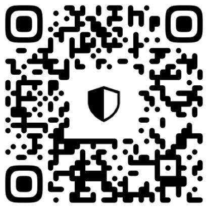

# LINK Staking Script

## Project Description
This project is a Python 3 script that automates staking LINK tokens into a Chainlink staking pool. It checks the pool's available space every 200 milliseconds and stakes the maximum possible amount of LINK from your wallet if space is available

## Prerequisites
- Python 3 (>= 3.8)
- pip(pip3) (>= 20.x)

## Setup
1. **Clone the repository:**
```bash
git clone git@github.com:nixjs/link-staking-cron-py.git
cd link-staking-cron
```
2. **Install dependencies:**
```shell [bash]
pip install -r requirements.txt # use python,pip/python3,pip3
```

```shell [Makefile]
make # use C
```

3. **Create a .env file in the root directory:**
```env
PRIVATE_KEY=your_private_key_here
STAKING_CONTRACT_ADDRESS=0xBc10f2E862ED4502144c7d632a3459F49DFCDB5e
ETHEREUM_RPC=https://mainnet.infura.io/v3/INFURA_ID #https://1rpc.io/eth
CHECK_INTERVAL_MS=200
```
- [Contract address of the Community Pool](https://etherscan.io/address/0xBc10f2E862ED4502144c7d632a3459F49DFCDB5e)
- [How to export an account's private key](https://support.metamask.io/configure/accounts/how-to-export-an-accounts-private-key/)
- [How to get rpc url](https://chainlist.org/chain/1)

4. **Run**
```shell [bash]
python3 src/stake_cron.py # use python/python3
```

```shell [Makefile]
make cron # use C
```

## Node
- Ensure your wallet has enough ETH for gas and LINK for staking.

- Check the contract's requirements (e.g., approval) if staking fails.

- Running every 200 milliseconds may lead to high RPC usage.

- Allow to config interval time (Recommend: 200ms - 300ms):
```bash
INTERVAL_MS=200
```

## Donate


- [USDT (Ethereum)](https://link.trustwallet.com/send?address=0x66dF9428a207C54b21716c1a94f835dc7f30FC5A&asset=c20000714_t0x55d398326f99059fF775485246999027B3197955): 0x66dF9428a207C54b21716c1a94f835dc7f30FC5A
- [USDT (BSC)](https://link.trustwallet.com/send?address=0x66dF9428a207C54b21716c1a94f835dc7f30FC5A&asset=c20000714_t0x55d398326f99059fF775485246999027B3197955): 0x66dF9428a207C54b21716c1a94f835dc7f30FC5A


- [USDT (Tron)](https://link.trustwallet.com/send?asset=c195_tTR7NHqjeKQxGTCi8q8ZY4pL8otSzgjLj6t&address=TJH7ybLiThyN5rQygRLfCxHwDMwwZ7DUHZ): TJH7ybLiThyN5rQygRLfCxHwDMwwZ7DUHZ